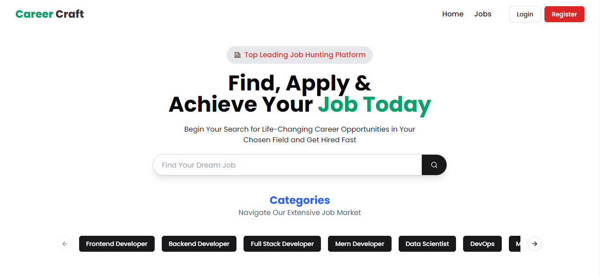
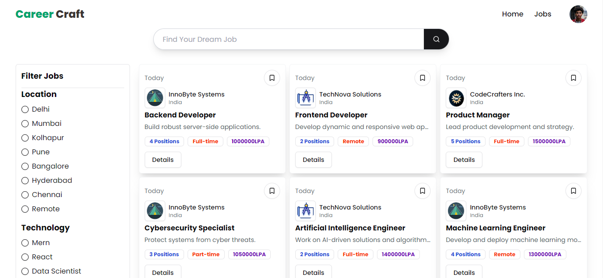
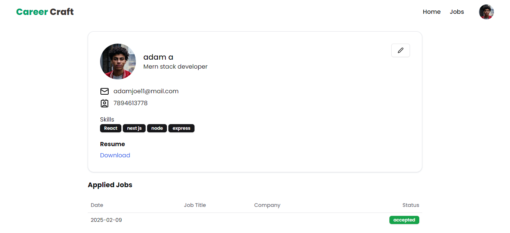
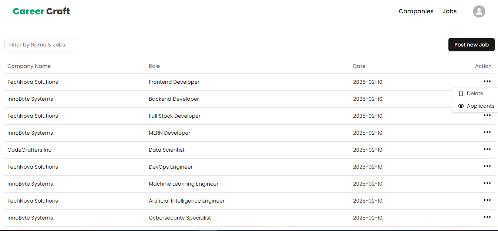

# Career Caraft - Job Portal

This project is a fully functional job portal website that manages job postings, receives applications, and creates a hiring workflow for these applications. It is built using the MERN stack: MongoDB, Express, React, and Node.js.
## Features

- User account creation and login with role-based access
- Job posting creation and management
- Application submission and tracking
- Multiple form checks for candidates
- Coordinator and recruiter dashboards for managing job postings and application
## Screenshots







## Installation

Clone the repository:
```
git clone https://github.com/Shahidclt93/CareerCraft-JobPortal.git
cd CareerCraft-JobPortal
```
Install server dependencies:
```
cd server
npm install
```

Install client dependencies:
```
cd client
npm install
```

Create a .env file in the server directory and add the following:
```
PORT = port 
MONGO_URI= your_mongodb_connection_string
JWT_SECRET= your_jwt_secret
CLOUDINARY_NAME: your_cloundinary_name
CLOUDINARY_API_KEY: your_cloundinary_apikey
CLOUDINARY_API_SECRET: your_cloundinary_apisecret

```

Start the development server:
```
cd server
npm run dev
```

Start the client:
```
cd client
npm start
```

## Tech Stack

**Client:** React, Redux, TailwindCSS

**Server:** Node, Express, Mongoose

**Database:** MongoDB


